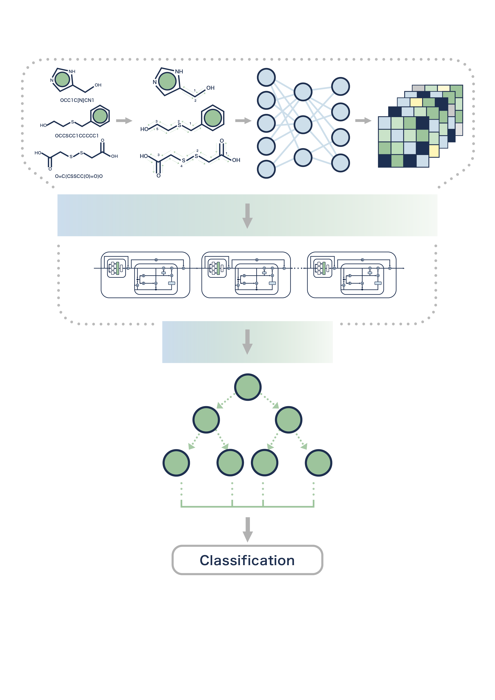

<p align="center">
  
</p>

----


[](https://opensource.org/licenses/MIT)
[](https://doi.org/10.1101/2023.11.28.568989)

ChemXTree is a package in drug discovery based on a graph model and tree-based algorithms, with a differentiable decision tree for precise molecular property prediction. ChemXTree introduces the Gate Modulation Feature Unit (GMFU) for advanced feature refinement. This model is tested on MoleculeNet, showing enhanced attribute optimization and competitiveness.


## Highlights
* The pretrained model (.ckpt) for BBBP and BACE is given at Google Drive:
   [BBBP](https://drive.google.com/file/d/1t9Wbcuahx-Vqybzq7efiyuiKYei-57Lo/view?usp=sharing)
   [BACE](https://drive.google.com/file/d/1lHGXI_WiGMUy53tT6qcvn0nD810Q5CMr/view?usp=sharing)
* Also, you can re-run `examples\chemxtree\BBBP\BBBP.py` or `examples\chemxtree\BACE\BACE.py` with the provided configuration to reconstruct the fine-tuned model.


## Contents
* [Citation](#cite-our-work)
* [Get Started](#get-started)
  * [Requirements and Installation](#requirements-and-installation)
    * [Local](#option-2-installing-from-source)
    * [Colab](#option-5-temporary-usage-on-colab)
  * [Quick Start Examples](#quick-start-examples)
    * [Google colaboratory](#start-with-google-colaboratory)
    * [Local](#start-at-local)
    * [Make Fingerprints](#to-solely-make-fingerprints-via-mpnn)
    * [Bayesian Optimization for Hyperparameters](#to-solely-train-the-gmfu-by-applying-pre-constructed-fingerprints)
  * [Data](#data)
* [Workflow](#workflow)
* [Acknowledgements](#acknowledgements)


## Cite our work
Please kindly cite this paper if you use the code:
```
@article {
	title = {ChemXTree:A Tree-enhanced Classification Approach to Small-molecule Drug Discovery},
	year = {2023}
}
```


## Get Started

### Requirements and Installation

#### Environment
Dockerfile will release soon: [Dockerfile](/Dockerfile)
For overall ChemXTree package, run exist `setup.py` in top level package:
```
pip install .
```
For GMFU, firstly enter the module-level directory,
```
cd GMFU
```
Then run module-level `setup.py`,
```
pip install .
```

#### Option 1: Installing from PyPi

1. `conda create -n ChemXTree python=3.8`
2. `conda activate ChemXTree`
3. `pip install git+https://github.com/StarLiu714/ChemXTree.git`

#### Option 2: Installing from source

1. `git clone https://github.com/StarLiu714/ChemXTree.git`
2. `cd ChemXTree`
3. `conda env create -f environment.yml`
4. `conda activate ChemXTree`
5. `pip install -e .`

#### Option 3: Download and unzip then run the command
```
bash install.sh
```

#### Option 4: Run `setup.py`
```
python setup.py
```

#### Option 5: Temporary usage on colab
For the entire ChemXTree package, you should run the Jupyter magic command as follows:
```
!pip install chemprop==1.6.* rdkit-pypi==2022.9.* lightgbm==4.0.* xgboost==2.0.* omegaconf==2.3.* einops==0.7.* lightning_lite==1.8. pytorch-lightning==1.8.* category_encoders==2.6.*
```
For simple MPNN Pipeline,
```
!pip install chemprop==1.6.* rdkit-pypi==2022.9.* lightgbm==4.0.* xgboost==2.0.*
```
For simple GMFU,
```
!pip3 install omegaconf==2.3.* einops==0.7.* lightning_lite==1.8. pytorch-lightning==1.8.* category_encoders==2.6.*
```
Or alternatively, after putting requirements.txt on '/content/' folder
```
!pip install -r "requirements.txt"
```


### Quick Start Examples
**Note:** Recommended for use with GPU acceleration. No more setting is needed when you applying GPU.
#### Start with Google colaboratory
Upload the `example_colab.ipynb` along with the example dataset to your Google Drive,
Then click 'Run all' (Ctrl+F9) to start a very basic training session!

#### Start at local
```
python example.py
```
An example training `CYP2C9` dataset by all default hyperparameters

#### To solely make fingerprints via MPNN
```
python example_mpnn.py
```
An example constructing `BBBP` 5-size fingerprints

#### To solely train the GMFU by applying pre-constructed fingerprints
```
python example_gmfu.py
```
Applying `optuna` for bayesian optimization on `BBBP` 5-size fingerprints

#### To reconstruct state-of-art model fine-tuning by our parameters
```
python /BBBP/BBBP.py
```
OR
```
python /BACE/BACE.py
```

### Data
The data file must be a **CSV file with a header row**. For example:
```
SMILES,targets
CCOc1ccc2nc(S(N)(=O)=O)sc2c1,0
CCN1C(=O)NC(c2ccccc2)C1=O,1
...
```
Example datasets is given in `Datasets` directory, which is like:
```
Datasets
  |- BACE
    |- test_fingerprint.csv
    |- train_fingerprint.csv
    |- valid_fingerprint.csv
  |- BBBP
    |- test_fingerprint.csv
    |- testBBBP.csv
    |- train_fingerprint.csv
    |- trainBBBP.csv
    |- valid_fingerprint.csv
    |- validBBBP.csv
  |- CYP2C9
    |- testCYP2C9.csv
    |- trainCYP2C9.csv
    |- validCYP2C9.csv
  |- HIV
    |- testHIV.csv
    |- trainHIV.csv
    |- validHIV.csv

```


## Workflow
<p align="center">
  
</p>


## Acknowledgements
This project has benefited immensely from several external resources and contributions. We would like to express our heartfelt gratitude to:
- [**Therapeutics Data Commons (TDC) Database**](https://doi.org/10.7910/DVN/21LKWG)
- [**DeepChem**](https://github.com/deepchem/deepchem)
- [**MoleculeNet**](https://moleculenet.org/)
- [**GANDALF**](https://arxiv.org/abs/2207.08548)
- [**ChemProp**](https://github.com/chemprop/chemprop)

These resources have been instrumental in the progress and achievements of our project. We extend our sincere thanks to all the developers and contributors of these projects for their hard work and dedication.


